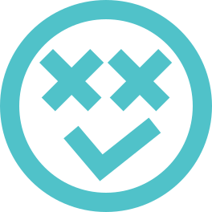

# Fatto - A Vue3 to-do list app

Fatto is a simple to-do list app built using Vue 3, HTML, and TailwindCSS. It provides a responsive user interface and uses the Vue Composition API.

## Live demo
You can see the Fatto app live at [Fatto App](https://fatto-app.netlify.app/). The app is deployed using Netlify.

## Table of contents
1. [Live demo](#live-demo)
2. [Table of contents](#table-of-contents)
3. [Main features](#main-features)
4. [Folder structure](#folder-structure)
5. [Usage](#usage)
6. [Contributing](#contributing)
7. [License](#license)

## Main features
- Full user authentication and authorization using Supabase
- Responsive design for various devices using TailwindCSS
- Pinya for state management
- Task creation, update, and deletion
- User account management, including name, email, and password changes
- Forgot password functionality
- Dark mode and sorting preference settings stored in Supabase

## Folder structure
The project's file structure is organized as follows:

└── 📁fatto-app
    └── README.md
    └── 📁src (Source files)
        └── App.vue
        └── 📁api (API functions)
            └── userApi.js
            └── …
        └── 📁assets (Visual assets)
            └── logo.svg
            └── …
        └── 📁components (Components integrated into the views)
            └── TasksEmptyState.vue
            └── TaskCard.vue
            └── …
        └── 📁lib
            └── supabaseClient.js (Module for integrating with Supabase client)
        └── main.js
        └── 📁router (Router configuration)
            └── index.js
        └── 📁stores (Pinia stores for state management)
            └── tasksStore.js
            └── …
        └── 📁views (Main pages of the app)
            └── TasksView.vue
            └── …
    └── …

## Usage
To run the Fatto app locally, follow these steps:

1. Clone the repository to your local machine.
2. Run `npm install` in the root directory.
3. Run `npm run dev` in the root directory.
4. Open the local host URL in your browser.

## Contributing
Contributions to enhance Fatto app are welcome. If you have suggestions, bug reports, or feature requests, feel free to open an issue or submit a pull request.

## License
This project is licensed under the [MIT License](https://github.com/steroman/midproject/blob/main/LICENSE) License.